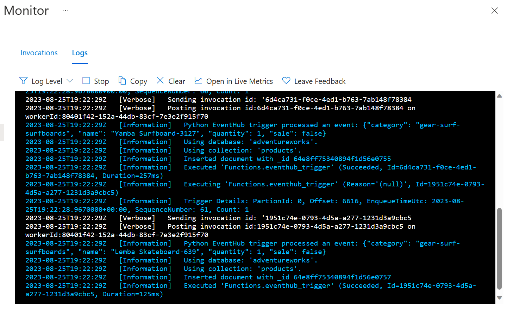

# Python Azure Functions<br>Event Hubs to MongoDB

A Python Azure function that triggers on Azure EventHubs messages and saves them to Cosmos MongoDB.

## Requirements

- Linux Azure Function
- Eventhub with a hub
  - Create a hub
  - Create a listening policy
  - Create a send policy
  - Record the name space and the keys for each policy
- MongoDB CosmosDB
  - Record the connection string

## Azure Function Creation

Create a function:

- <https://learn.microsoft.com/en-us/azure/azure-functions/create-first-function-vs-code-python?pivots=python-mode-decorators>

### Azure Function Python Support

- Max: 3.10
- Min: 3.6

## Local Development & Debugging

Environment:

- VS Code
- VS Code Function App
- VS Code Azurite (Storage Emulator)
- VS F1: azurite: Start

Recommended:

- `virtualenv` or `pyenv`

### Debuging

- Create a `local.settings.json` file:

```json
{
  "IsEncrypted": false,
  "Values": {
    "FUNCTIONS_WORKER_RUNTIME": "python",
    "AzureWebJobsStorage": "UseDevelopmentStorage=true",
    "AzureWebJobsFeatureFlags": "EnableWorkerIndexing",
    "EVENTHUB_STR": "<FULL_SEND_POLICY_CONNECTION_STRING>"
  }
}
```

- From VS Code, start the storage emulator:
  - Press F1, find `azurite: Start`, and select it
- From VS Code press: `F5`

## Deploying to Azure

- Create an Azure Function consumption
  - Include storage and Application Insights
- Once created
  - Deploy the app
  - From VS Code, deploy the app
- In the Azure function app settings override the following settings:

```bash
EVENTHUB_STR=<FULL_LISTEN_POLICY_CONNECTION_STRING>
CONNECTION_STRING=<COSMOS_MONGODB_CONNECTION_STRING>
DB_NAME=<MONGO_DB_NAME>
COLLECTION_NAME=<MONGO_COLLECTION_NAME>
```

## Expected Logs


